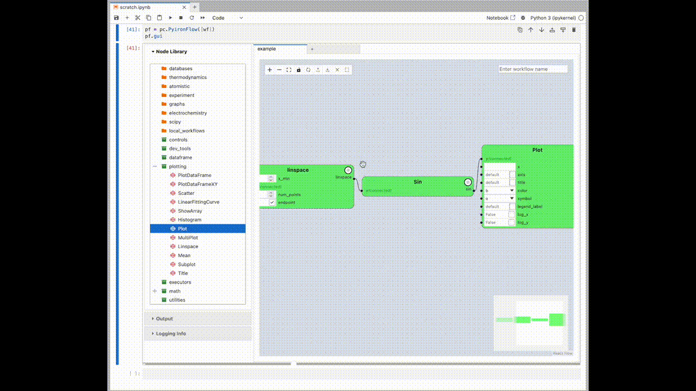

# Overview

`pyiron_core` is a workflow management system for Python that leverages a graph-based system -- including a visual scripting GUI -- to develop and execute workflows.

Key features:
- **Hybrid workflow creation** -- Code or visual scripting? Mix-and-match text-based and GUI design to best fit where you are in the development process.
- **Jupyter-native** -- Create, inspect, and execute `pyiron_core` nodes without ever leaving your notebook.
- **Boilerplate-free** -- Convert your regular python functions into graph nodes with a single decorator.
- **Hash-based caching** -- Workflows patterns can be identified by hashes of input data and graph edges to re-load results from a cache for rapid iteration
- **Inclusive node library** -- Get rolling quickly with a pre-built library of nodes, and extend your capabilities with easy node creation



## Getting started

The user-facing API is found directly in the `pyiron_core` namespace, and after installation you can get running with `import pyiron_core as pc` and explore the dot-completion menu `pc...` for key tools.

To jump in with the graphical interface, just spin up the binder demo and start exploring a selection of materials science-oriented workflows!

[](https://mybinder.org/v2/gh/pyiron/pyiron_core/main?urlpath=%2Fdoc%2Ftree%2Fdemo.ipynb)

You can download a tutorial mp4 [from this repo](https://github.com/pyiron/pyiron_core/raw/main/documentation/pyiron_core_demo.mp4) to see a demonstration of key features.

## Installation

For a development installation, or to stay fresh with the bleeding edge of `pyiron_core`, install the conda environment locally and build the GUI:

```bash
git clone https://github.com/pyiron/pyiron_core.git
cd pyiron_core
conda env create -n pyiron_core -f project-env.yml
conda activate pyiron_core
conda install -c conda-forge nodejs=18  # unless you already have npm available
npm install; npm run build
```

Don't forget to modify your start-up script to add the `pyiron_core` location to your `PYTHONPATH`.

Alternatively, you can pip-install the current version to have it accessible in your existing python environment. First, make sure [you have `npm` installed](https://docs.npmjs.com/downloading-and-installing-node-js-and-npm), then:

```bash
git clone https://github.com/pyiron/pyiron_core.git
cd pyiron_core
pip install .
```

For full functionality you will also want `postgres`.
With `conda` this can be installed with `conda install -c conda-forge postgresql`.
[`pyiron_core.pyiron_workflow.api.util.LocalPostgres`](./pyiron_core/pyiron_workflow/util.py) is a helper tool for configuring your local postgres instance, and is leveraged in the educational notebooks.

Windows is not currently supported.
Osx ARM machines should be able to install the package, but may encounter hiccups using some workflow nodes.
